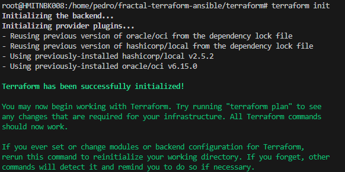
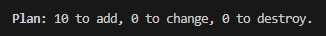
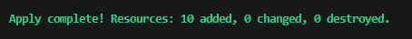
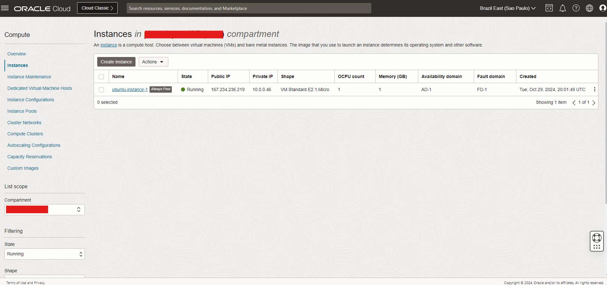
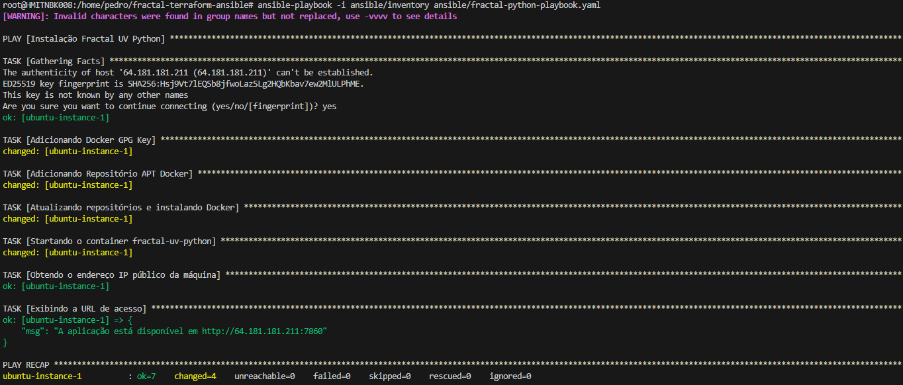
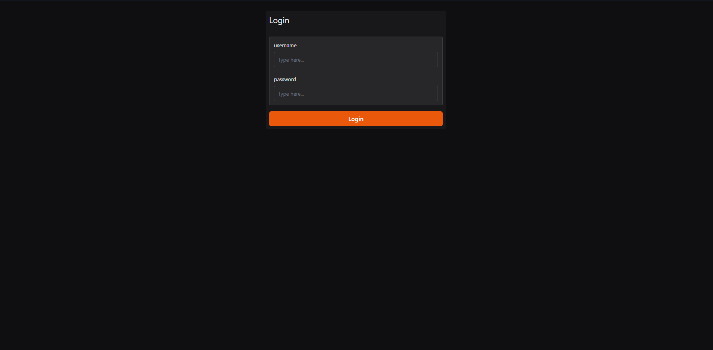

# Gerador de Fractais com Terraform e Ansible

<br>

# Objetivo
O Projeto tem como objetivo principal a implementação do Gerador de Fractais na OCI (Oracle Cloud Infrastructure), utilizando Terraform e Ansible.

<br>

# Contribuidores
- Anderson Luiz Karl - 2417571
- Pedro Henrique Oliveira Lima - 2325859

<br>

# Arquivos do Terraform

- **1-provider.tf**: No arquivo estão declaradas as informações necessárias para o funcionamento da Cloud utilizada, que no caso será a OCI (Oracle Cloud Infrastructure), é nesse arquivo que contem as chaves de acesso para se conectar a nuvem.

- **2-networks.tf**: No arquivo estão declaradas as configurações dos seguintes itens de rede:

  - VCN (Virtual Cloud Network) Principal;
  - Internet Gateway (Acesso a internet) + Regras de saída;
  - Sub-Rede;
  - Regras do grupos segurança, liberando a porta 22(SSH) e a porta 7860(Aplicação Fractal). 

- **3-instances.tf**: No arquivo está declarada a máquina virtual a ser utilizada. Nesse projeto estamos utilizando a imagem do Ubuntu 22.04 LTS, mas, pode ser utilizado qualquer imagem Linux, porém, precisa ser da distribuição Debian. O tipo de instancia que usado é o *VM.Standard.E2.1.Micro* que faz parte da camada *Always Free-eligible* da Oracle Cloud.

- **4-outputs.tf**: O arquivo declara as saídas utilizadas após o provisionamento, é a partir delas é que o arquivo de inventário do Ansible será criado, tudo de maneira automática.

- **variables.tf**: Arquivo que contém as variáveis necessárias para o provisionamento correto do ambiente. Portanto, é de suma importância certificar-se das informações decladas, pois, qualquer informação errada pode impactar a criação. 

<br>

# Arquivos do Ansible

- **fractal-python-playbook.yaml**: Arquivo de PlayBook do Ansible, nele serão executados as sequintes tarefas:
  
  - Adiciona a chave GPG do Docker;
  - Adicionana o repositório do Docker;
  - Atualiza os repositórios e executa a instalação do Docker;
  - Inicializa o container do Gerador de Fractais;
  - Obtém e exibe a URL de acesso da aplicação fractal.

- **inventory**: Arquivo de inventário é criado automáticamente no momento do provisionamento da máquina virtual.

<br>

# Provisionamento Terraform

> ⚠️ **Aviso:** Estamos levando em consideração que você já possui o Terraform instalado e o usuário na Oracle Cloud com as devidas permissões para gerenciar o ambiente.

Para inicializar o projeto é necessário renomear o aquivo terraform/.variables.tf para terraform/variables.tf e preencher com os seu dados da OCI. Após o preechimento do arquivo, executar os seguinte comando que irá inicializar o ambiente terraform:

```
cd terraform
terraform init
``` 

<details>
  <summary>Saida desejada:</summary>
  
</details>

---

<br>

Após a inicialização do terraform, execute o comando abaixo que irá exibir tudo o que será ser adicionado, alterado ou removido da sua Cloud:

```
terraform plan
``` 
<details>
  <summary>Saida desejada:</summary>
  
</details>

---

<br>

Após validação, execute o comando abaixo que irá criar tudo o que está declarado nos arquivos do terraform e que foi exibido no comando *terraform plan*:

```
terraform apply
``` 
<details>
  <summary>Saida desejada:</summary>
  
</details>

<details>
  <summary>Instância em execução:</summary>
  
</details>

<br>

# Playbook Ansible

> ⚠️ **Aviso:** Estamos levando em consideração que você já possui o Ansible na sua versão mais recente instalado na sua máquina.

Após o provisionamento da máquina, executar a playbook do Ansible com os comandos:

```
cd ..
ansible-playbook -i ansible/inventory ansible/fractal-python-playbook.yaml
``` 

<details>
  <summary>Saida semelhante:</summary>
  
</details>

---

<br>

# Próximos Passos

Após o comando *ansible-playbook* gerar a URL da aplicação em sua saída, você pode testar o gerador de fractais.



- Usuário: *uniforfractal*
- Senha: *badcoffee*

Caso queira destruir o ambiente, executar os comandos:

```
cd terraform
terraform destroy
``` 

<br>

# Recursos Adicionais

Para mais informações e recursos úteis, confira os links abaixo:

- [Documentação do Ansible](https://docs.ansible.com/)
- [Configurar Terraform com a OCI](https://docs.oracle.com/pt-br/iaas/developer-tutorials/tutorials/tf-provider/01-summary.htm)
- [Documentação Terraform com Oracle Cloud](https://registry.terraform.io/providers/oracle/oci/latest/docs)
- [Repositório do Projeto Gerador de Fractais no GitHub](https://github.com/Artoshk/fractal)

<br>

### Agradecemos por utilizar a aplicação Gerador de Fractais!
